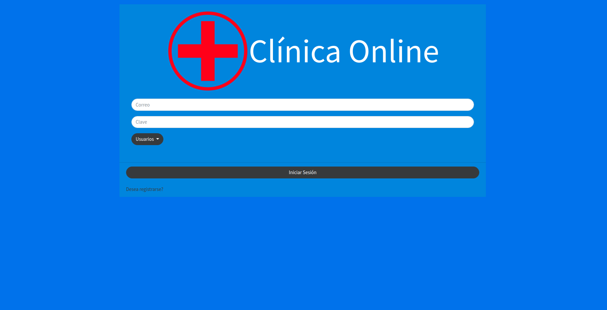
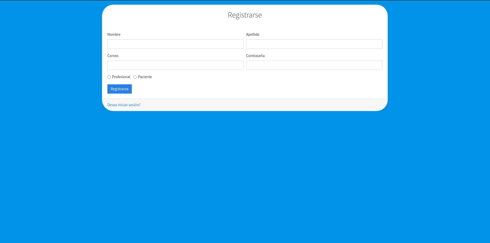

## :pushpin: <a href="https://clinicaonline-4cda1.web.app/">Link a la página</a> :pushpin:
 
--- 

---

## Login de la web

* Se tiene un boton que permite iniciar sesion desde distintos usuario

---

## Registro de la web

* El usuario podrá registrarse como profesional o como paciente

